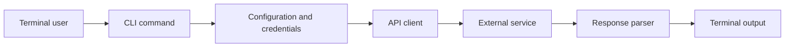

<!-- unified-readme:start -->
<div align="center">

# Reddit CLI

**Python CLI tool for browsing and interacting with Reddit from the terminal.**

Build. Automate. Share.

[](https://github.com/JayRHa/RedditCLI/stargazers)
[](https://github.com/JayRHa/RedditCLI/network/members)
[](https://github.com/JayRHa/RedditCLI/issues)
[](https://github.com/JayRHa/RedditCLI/graphs/contributors)

<h1>Reddit CLI</h1>
  <p><strong>Browse subreddits, search posts and check community stats from your terminal</strong></p>
  <p>
    
    
    
    
  </p>

<p>
  <a href="https://jannikreinhard.com/">Blog</a> ·
  <a href="https://www.linkedin.com/in/jannik-r/">LinkedIn</a> ·
  <a href="https://x.com/jannik_reinhard">X</a>
</p>

---

`CLI Tool` | `Python` | `Public` | `Maintained`

</div>

## What is this?

Reddit CLI wraps a service or workflow in a command-line interface so common tasks can be automated from a terminal, shell script, or scheduled job.

## Project Context

- Primary stack: Python.
- Typical usage starts with local configuration or credentials, then executes commands against the target service API.
- This repository is maintained as a practical project and reference asset.

## How It Works

The CLI parses user input, loads configuration, calls the external service, normalizes the response, and prints script-friendly output.



## Quick Start

1. Review the project context and workflow below.
2. Clone the repository:

   ```bash
   git clone https://github.com/JayRHa/RedditCLI.git
   ```

3. Continue with the setup, usage, or workflow sections below.

---
<!-- unified-readme:end -->

## Overview

`reddit` is a high-signal command line tool for:

- browsing hot, new, top and rising posts from any subreddit
- searching posts across Reddit or within a specific community
- fetching subreddit metadata (subscribers, active users, description)
- clean machine-readable JSON for pipelines
- fast terminal-first human output

## 60-Second Quickstart

```bash
python3 -m venv .venv
source .venv/bin/activate
python3 -m pip install -e .
export REDDIT_CLIENT_ID="<YOUR_CLIENT_ID>"
export REDDIT_CLIENT_SECRET="<YOUR_CLIENT_SECRET>"

reddit hot --subreddit python --limit 5
reddit top --subreddit programming --time week
reddit search --query "async await" --subreddit python
reddit sub-info --subreddit HomeAssistant
```

## Why It Feels Great To Use

- Single command surface: `reddit`
- Strict argument validation with clear errors
- Human view for operators, JSON view for automation
- No PRAW dependency, pure async HTTP via aiohttp
- Predictable exit codes for CI and scripts

## Install

```bash
python3 -m pip install -e .
```

If your Python is externally managed, use a virtualenv (recommended).

## Authentication

Create a Reddit app at https://www.reddit.com/prefs/apps (type: script or installed). Then use the client ID and secret:

```bash
reddit --client-id "<ID>" --client-secret "<SECRET>" hot --subreddit python
```

```bash
export REDDIT_CLIENT_ID="<ID>"
export REDDIT_CLIENT_SECRET="<SECRET>"
reddit hot --subreddit python
```

## Command Matrix

| Command | Purpose | Common flags |
| --- | --- | --- |
| `hot` | Hot posts from a subreddit | `--subreddit`, `--limit` |
| `new` | New posts from a subreddit | `--subreddit`, `--limit` |
| `top` | Top posts from a subreddit | `--subreddit`, `--limit`, `--time` |
| `rising` | Rising posts from a subreddit | `--subreddit`, `--limit` |
| `search` | Search Reddit posts | `--query`, `--subreddit`, `--limit`, `--sort`, `--time` |
| `sub-info` | Subreddit information | `--subreddit` |

## Usage Examples

### Hot posts

```bash
reddit hot --subreddit python --limit 10
reddit hot -s HomeAssistant -l 5 --json
```

### Top posts with time filter

```bash
reddit top --subreddit programming --time week
reddit top -s python -t month -l 20 --json
```

### New and rising

```bash
reddit new --subreddit rust --limit 5
reddit rising --subreddit webdev
```

### Search

```bash
reddit search --query "best IDE" --subreddit python
reddit search -q "home automation" --sort top --time year --json
reddit search -q "docker compose" -s selfhosted -l 15
```

### Subreddit info

```bash
reddit sub-info --subreddit HomeAssistant
reddit sub-info -s python --json
```

## Automation Recipes

Top 5 post titles from r/python as plain text:

```bash
reddit hot -s python -l 5 --json | jq -r '.posts[].title'
```

Total score of top posts this week:

```bash
reddit top -s programming -t week --json | jq '[.posts[].score] | add'
```

Posts with more than 100 comments:

```bash
reddit hot -s python -l 50 --json | jq '[.posts[] | select(.num_comments > 100)] | length'
```

Subreddit subscriber count for monitoring:

```bash
reddit sub-info -s HomeAssistant --json | jq '.subreddit.subscribers'
```

## Exit Codes

| Code | Meaning |
| --- | --- |
| `0` | Success |
| `1` | API/network/runtime error |
| `2` | Input/auth/rate-limit error |

## Troubleshooting

| Problem | Solution |
| --- | --- |
| `Auth error: Invalid client ID or secret` | Check REDDIT_CLIENT_ID and REDDIT_CLIENT_SECRET |
| `Error: Access denied to r/...` | The subreddit may be private or quarantined |
| `Error: Subreddit r/... not found` | Check spelling of the subreddit name |
| `Error: Rate limit exceeded` | Wait a minute and try again |
| `Input error: Client ID missing` | Set --client-id or export REDDIT_CLIENT_ID |

## Developer Notes

Run from source:

```bash
PYTHONPATH=src python3 -m reddit_cli --help
```

Compile check:

```bash
python3 -m compileall -q src tests
```

Tests:

```bash
PYTHONPATH=src python3 -m pytest -q
```

## Project Structure

```text
src/reddit_cli/
  cli.py           # parsing, OAuth, command execution, output rendering
  transform.py     # normalization of Reddit API responses
  const.py         # API URLs, defaults, valid filter values
  __main__.py      # python -m entrypoint
tests/
  test_transform.py
```

## Security

- Never commit API credentials.
- Prefer environment variables in CI/CD.
- Rotate credentials immediately if exposed.
- The CLI uses app-only OAuth (read-only access).
